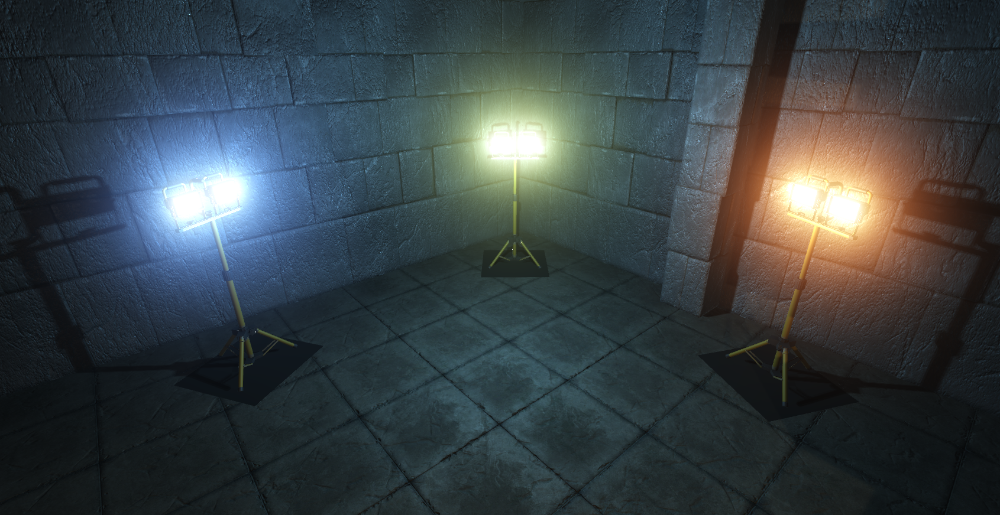
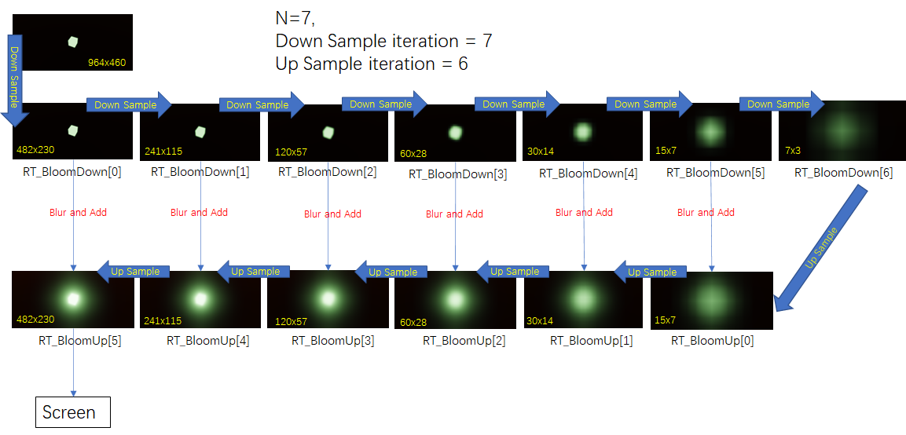
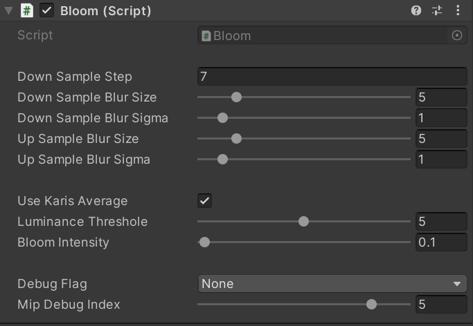
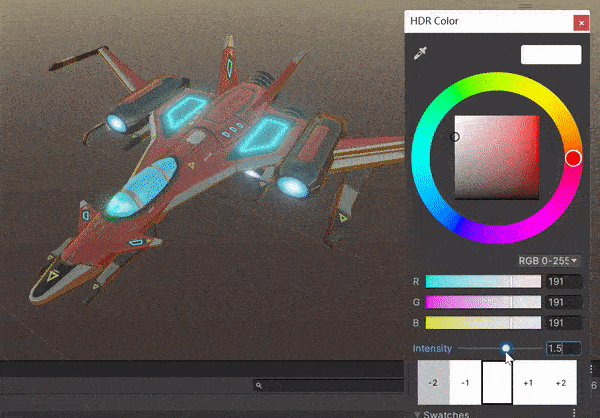

# Casual Bloom

High quality bloom effect implement with unity build-in render pipeline，just for study，not enough efficiency

# implement

simply using ping-pong down & up sample to blur the source image，apply tone-mapping and gamma-correct for bloom texture，then mix it to screen

# How to use

Add Bloom.cs script component to Main Camera，adjust some parameter based on you

make any method that cause pixel's luminance over the threshold，then it will generate bloom，for more bigger value，it gonna to have bigger bloom range

